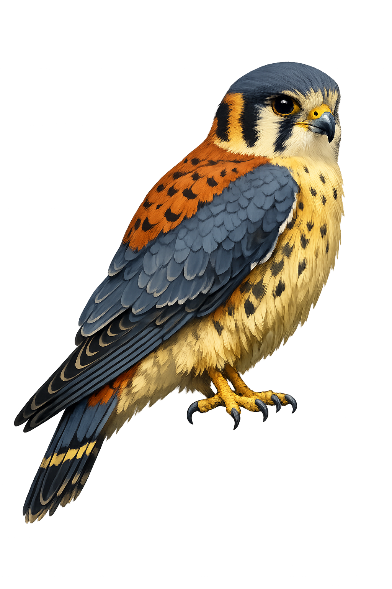

<div class="kst-hero" markdown>



# Kestrel

<p class="kst-tagline">Memory-safe. Taint-aware. Effect-typed.</p>

</div>

Kestrel is a systems programming language that makes security properties part of the type system -- not an afterthought. It combines C-style familiarity with Rust-level safety guarantees, and adds security dimensions that no other systems language has built in.

<div class="kst-features" markdown>

<div class="kst-feature" markdown>

### Memory Safety

No dangling pointers, no use-after-free, automatic deallocation. NOVA manages heap memory at compile time with zero runtime overhead.

</div>

<div class="kst-feature" markdown>

### Taint Tracking

User input is tainted at the source. The compiler refuses to let it reach a database query or shell command without sanitization.

</div>

<div class="kst-feature" markdown>

### Effect Types

Functions declare what they do: I/O, network, pure. A math library cannot sneak in a network call. The compiler enforces it.

</div>

<div class="kst-feature" markdown>

### Constant-Time Types

`secret[T]` values cannot leak through timing side-channels. The compiler rejects branches on secret values.

</div>

</div>

## Hello, Kestrel

```kestrel
func main() -> int32 {
    str name = "world"
    printf("Hello, %s!\n", name)
    return 0
}
```

## A taste of the safety model

```kestrel
// The compiler tracks that 'input' came from user data
@tainted str input = read_line()

// This would be a compile error — tainted data cannot reach a SQL sink
// db.query("SELECT * FROM users WHERE name = '{input}'")

// Sanitize first, then use
str safe = sanitize(input)
db.query("SELECT * FROM users WHERE name = '{safe}'")
```

## Install

Download pre-built binaries from the [GitHub Releases](https://github.com/kestrel-build/kestrel/releases) page, or build from source:

```bash
git clone https://github.com/kestrel-build/kestrel
cd kestrel
cargo build --release
```

## Get started

- [Installation guide](getting-started.md)
- [Language guide](language-guide/overview.md)
- [Security model](security/overview.md)
- [Example programs](https://github.com/kestrel-build/examples)
